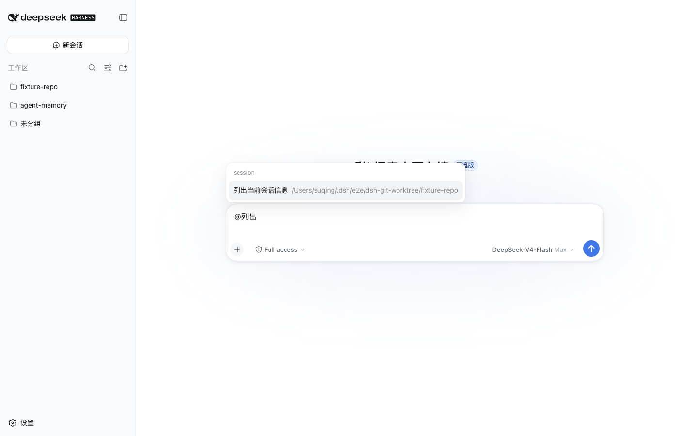
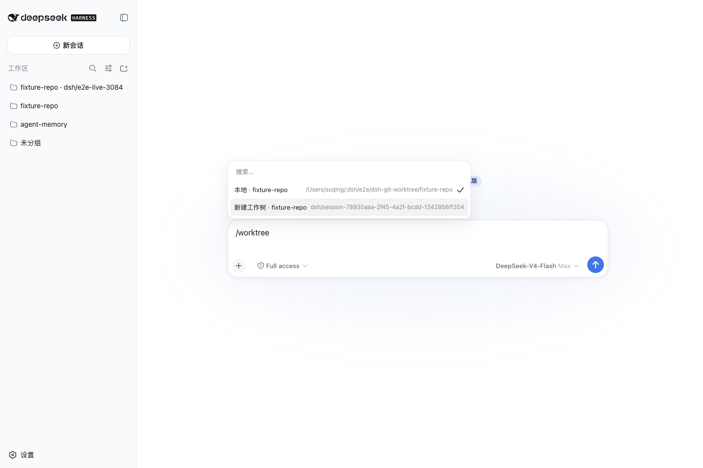

# dsh-plugins

[English](README.md) | 中文

[DeepSeek Harness (DSH)](https://github.com/deepseek-ai/deepseek-harness) 的第三方插件仓库。`packages/` 下每个目录都是一个可独立安装的插件。

已发布的 `0.2.0` 集合按 `@deepseek-ai/dsh@0.1.0-rc.6` 验证。仓库源码目标线为 `0.2.0-rc.2`。2026-10-06 退役了五个包——`dsh-agent-plugins`、`dsh-thinking-collapse`、`dsh-codex-login-dock`、`dsh-openai-codex-oauth`、`dsh-composer-skill-mention`——下列三个包是保留维护集；该源码集合尚未发布。

## 安装

需要 Node.js 22 或更高版本，并确保 `pnpm` 在 `PATH` 中。按需将插件安装到 DSH Web profile：

```bash
dsh plugin --profile web add @suqingsq/dsh-session-tools@0.2.0
dsh plugin --profile web add @suqingsq/dsh-worktree-workspaces@0.2.0
```

每个包都可以独立安装。以上命令固定到已按 DSH `0.1.0-rc.6` 验证的插件版本；完整 scoped 包集合也已在日常 DSH `0.1.0-rc.7` Web profile 中完成安装与加载回读。`dsh-ui-zoom` 尚未发布，因此不提供安装命令。

旧 unscoped 包名已经弃用；对应已退役包的 scoped 版本不再维护。

## 插件

### [@suqingsq/dsh-session-tools](packages/dsh-session-tools/README.zh.md)

六个模型侧会话工具，以及 Web `@` 会话候选：选中后把另一会话作为带出处的上下文注入本轮。



### [@suqingsq/dsh-worktree-workspaces](packages/dsh-worktree-workspaces/README.zh.md)

创建和归档 Git linked worktree。同一包提供 `/worktree`、模型工具、CLI，以及用于切换 DSH Workspace 的 Web 弹层。



### [@suqingsq/dsh-ui-zoom](packages/dsh-ui-zoom/README.zh.md)

Web 与桌面端的整体界面缩放：设置页「整体界面缩放」行（−/+ 与重置），以及可按 profile 持久化的缩放百分比。尚未发布。

## 仓库

本仓库是 pnpm workspace。包约定见 [AGENTS.md](AGENTS.md)。插件索引见 [`packages/README.md`](packages/README.md)，版本历史见 [CHANGELOG.md](CHANGELOG.md)。

## License

[MIT](LICENSE)
