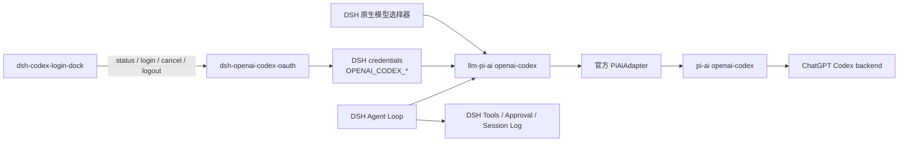

# DSH Codex 会话内登录卡设计

- 状态：Host silent 登录、Web dock 与 Settings 独立页已实现；`@suqingsq/dsh-openai-codex-oauth@0.2.0` 与 `@suqingsq/dsh-codex-login-dock@0.2.0` 已发布并在日常 rc.7 Web profile 中激活
- 发布包：`@suqingsq/dsh-codex-login-dock` + 本仓库维护的 `@suqingsq/dsh-openai-codex-oauth`
- 复用 OAuth：本仓库 `packages/dsh-openai-codex-oauth`（fork 自 [`dyuan311/dsh-openai-codex-oauth@0.1.1`](https://github.com/dyuan311/dsh-openai-codex-oauth)；Host 命令 `/codex-login`、`/codex-status`、`/codex-logout`、silent `ctx.openaiCodexOAuth` + `llm-pi-ai` 的 `openai-codex` 路由）
- DSH 验证基线：`@deepseek-ai/dsh@0.1.0-rc.6` / `deepseek-harness@47f943859bef60e4160492346772ded9b24f765a`
- `@earendil-works/pi-ai` 审查基线：`0.82.1`
- 画稿：`docs/web/dsh-codex.pen`（按 `@deepseek-ai/dsh@0.1.0-rc.6` Web chrome 重画：侧栏、对话/轨迹、composer 座位；无右栏、无 Codex CLI 壳）
- 设计日期：2026-08-16

## 1. 目标与结论

目标不是在 DSH 中增加一个 Codex Tab，也不是再实现一套 OAuth 或 LLM adapter。目标是：用户在 **DSH 原生模型选择器** 中选中 `openai-codex`（展示名「Codex 订阅」）后，若尚未登录，composer **上方 dock** 出现登录卡；主路径为 **浏览器 PKCE**。设置里另有独立的「Codex 订阅」页，已连接时显示「已连接」并可退出。登录成功后 dock 消失，后续对话、工具和审批全部走原生 DSH。

OAuth 落盘、token refresh、以及把 access token 交给官方 `PiAiAdapter`，都走本仓库维护的 `dsh-openai-codex-oauth`。`dsh-codex-login-dock` 只补会话内登录卡、设置页和无密钥状态面。



不采用 Codex App Server 作为主模型传输层，也不自建 `~/.dsh_codex`。

## 2. 交付边界

### 2.1 本包要做

- 当当前 session 选中 `openai-codex` 且凭据未就绪时，在 `conversation.input.dock` 显示登录卡；
- 在 Settings 注册独立 `settings.section`（导航名「Codex 订阅」）：未登录可浏览器登录，已连接显示「已连接」并可退出；不嵌进原生模型那一行，不走 `settings.register`；
- 主按钮启动浏览器 PKCE；登录中可取消；过期后同一张卡变成「重新登录」；
- Client 只读取 `signedOut`、`authorizing`、`ready`、`expired`、`error`，以及稳定错误码；
- 未登录时通过 `ctx.conversation.blocks` 禁用发送，模型座位保持可点；
- 用 `cordis.patch.yml` 为 `openai-codex` 补 `displayName: Codex 订阅`，不重复注册 adapter；`apiKeyEnv` 与 displayName 同写在 OAuth 包 patch 里，避免整对象替换丢掉 token env；
- 登录失败、`1455` 端口占用和 refresh 失败都保持可见。
- 设置页和 dock 走 silent `loginBrowser`，不依赖 live agent，不往会话写 `/codex-login`，不接管 composer。

### 2.2 明确不做

- 不自建 Credential Store，不写 `/Users/suqing/.dsh_codex`；
- 不读取、复制或软链接 `/Users/suqing/.codex/auth.json`；
- 不注册第二份 `ctx.llm` adapter，不与 `llm-pi-ai` 抢 `openai-codex` 路由；
- 不修改、不占用 `conversation.input.model`，不自绘模型选择器；
- 不把登录嵌进原生 Settings → 模型那一行（rc.6 没有 `settings.models.provider-editor`）；
- 不走 `settings.register` 写 settings.yaml，也不在设置里粘贴 token；
- 不用 `conversation.composer` takeover 做登录（该链给审批和提问）；
- 不做居中向导、Device Code 主路径、套餐额度或 rate-limit 仪表盘；
- 不引入 `pi2dsh` 整包引擎；不改造 `@deepseek-ai/dsh-subagent-codex`；
- 不新增 Codex Tab、独立时间线或右侧插件检查器；
- 不为尚未出现的复用需求预建 `shared`、`core` 或 `utils` 包。

### 2.3 依赖插件已经提供的能力

`dsh-openai-codex-oauth` 已交付：

- `/codex-login [browser|device]`、`/codex-status`、`/codex-logout`；
- Host silent 面 `ctx.openaiCodexOAuth.loginBrowser` / `logout`（设置页和 dock 主路径）；
- 完整 OAuth 凭据写入 `OPENAI_CODEX_OAUTH_CREDENTIAL`，access token 写入 `OPENAI_CODEX_ACCESS_TOKEN`（默认落在 `$DSH_HOME/.credentials.yaml`）；
- 请求前 refresh，并把 token 交给官方 `llm-pi-ai` 的 `openai-codex` 路由；
- 不碰默认 Codex Home。

本包把「在会话和设置里看见并完成登录 / 退出」补上，而不是再做一遍 PKCE。

## 3. 方案取舍

### 3.1 为什么复用 `dsh-openai-codex-oauth`

| 候选 | 结论 |
| --- | --- |
| `dsh-openai-codex-oauth` | **采用，并 fork 进本仓库维护。** Codex-only，走官方 `llm-pi-ai` 与 `ctx.credentials`。斜杠 `/codex-login` 仍可弹提问卡；设置页和 dock 走 silent `loginBrowser`。 |
| `pi2dsh` | 不采用。它是整包 Pi 引擎，OAuth 只是其中一层，依赖面远大于登录卡。 |
| `@jcy2387/dsh-codex-provider-plugin` | 不采用为首依赖。它自己注册 adapter 和 Settings 页，并展示用量；与「只补 dock、不抢路由」冲突。 |
| 自建 `~/.dsh_codex/oauth.json` | **否决。** 与 DSH cookbook 的 credentials seam 重复，也和现有 OAuth 插件抢同一套 token。 |

### 3.2 凭据放哪里

使用 OAuth 插件已经占用的 DSH credentials 引用，不新建目录。

- 完整 OAuth JSON：`OPENAI_CODEX_OAUTH_CREDENTIAL`
- 当前 access token：`OPENAI_CODEX_ACCESS_TOKEN`
- 默认文件：`$DSH_HOME/.credentials.yaml`（本机常见为 `/Users/suqing/.dsh/.credentials.yaml`）
- 本包 Host 可以 `describe` / 判断是否存在，但 **不得把 token、refresh token、account id 发到 Client**

这同时满足「不碰 `/Users/suqing/.codex`」和「不自造第二份密钥文件」。

### 3.3 登录如何从 dock / 设置启动

OAuth 插件的 `/codex-login` 在浏览器等待期会走 `userQuestions`（composer takeover），并且 `commands.execute` 会把命令卡写进当前会话。设置弹层会挡住这张提问卡。

**已选定：** 设置页和 dock 调用 silent `ctx.openaiCodexOAuth.loginBrowser`。强制 browser、Host 打开系统浏览器、只回调完成 / 失败 / 取消，不再弹出提问卡，也不写会话命令日志。`/codex-login` 与 `/codex-login device` 保持交互式斜杠路径。

禁止在 `dsh-codex-login-dock` 里再实现一遍 PKCE、callback server 或 refresh。

## 4. Web 产品设计

画稿三张板对应三个可实现状态，不再画覆盖时间线的居中大卡。

```text
DSH Conversation
├── 原生消息时间线
├── 原生 reasoning / tool / approval 卡片
└── 原生 composer 栈
    ├── conversation.input.dock   ← 本包登录卡（未登录 / 登录中 / 过期）
    ├── 原生 InputBar
    │     └── conversation.input.model  ← 原生 Provider / Model / Effort
    └── 已连接时 dock 不渲染
```

### 4.1 画板与状态

| 画板 | 用户问题 | 插件可见物 | 原生可见物 |
| --- | --- | --- | --- |
| DSH · 未登录 dock | 选了 Codex 但还不能发 | composer 上方登录卡；发送被 block | 侧栏、对话 Tab、模型座位 |
| DSH · 原生模型选择器 | 要换模型或 effort | 无（dock 不渲染） | composer 模型菜单，两级 Model / Effort |
| DSH · 已连接会话 | 正常对话 | 无 | 原生气泡、上下文注入、思考折叠、工具行、composer |
| DSH · 设置 · 模型 | 装上插件后 Settings 里有没有这一行 | 无；只补 displayName | 原生设置弹层列出「Codex 订阅」 |
| DSH · 设置 · Codex 订阅 | 在设置里登录或退出 | 独立 `settings.section`；已连接显示「已连接」+「退出登录」 | 原生设置弹层导航（rc.6 图标为通用齿轮） |

### 4.2 登录卡内容

未登录：

- 标题：Codex 订阅需要登录
- 说明：使用 ChatGPT 订阅在系统浏览器完成授权。凭据写入 DSH credentials，不会读取 `~/.codex`。
- 主按钮：打开浏览器登录
- 次按钮：稍后
- 脚注：主路径为浏览器 PKCE · 回调 `localhost:1455`

登录中：同一张卡改为「正在等待浏览器授权」，主按钮变为取消。不要把 device code 画成主路径。

过期 / refresh 失败：标题改为「登录已过期」，主按钮「重新登录」，保留原错误码。

已连接：dock 不占位。设置页仍显示「Codex 订阅已连接」，主按钮「退出登录」。

### 4.3 槽位规则

- 用 `conversation.input.dock`，与 Todo / Queue dock 共存；登录卡 `order` 紧贴输入条。
- 用独立 `settings.section`（`id: codex-subscription`）承载设置页登录/退出；不占用 `settings.models` 行内编辑器。
- 不占用 `conversation.input.model`。
- 不用 `conversation.composer` takeover。
- 不用 `shell.overlay` 做登录向导。
- 右侧栏按原生 DSH chrome 理解，本包不往 details 塞 Credential Store 检查器。
- 可选：`conversation.session.header.utilities` 只在已连接时显示「Codex 订阅已连接」。

## 5. 包边界

```text
packages/dsh-openai-codex-oauth/   # fork：凭据、PKCE、refresh、slash 命令、silent Host 面
packages/dsh-codex-login-dock/
├── package.json
├── cordis.patch.yml          # 只插入 login-dock；displayName/apiKeyEnv 在 oauth 包
├── src/
│   ├── index.ts              # Host：无密钥状态、触发 silent 登录/取消/退出
│   ├── protocol.ts           # 稳定状态与错误码
│   └── client/
│       ├── index.tsx         # conversation.input.dock + settings.section
│       ├── LoginDock.tsx
│       └── SettingsSection.tsx
├── tests/
└── README.md / README.zh.md
```

Host 与 Client 不能独立形成完整能力，login-dock 仍是一个包。OAuth 引擎是另一个可独立安装的包。只有真实 Client bundle 与 `cordis.patch.yml` 时才声明 `dsh.bundle`。

运行时依赖 `dsh-openai-codex-oauth` 已安装。缺失 silent 服务时 dock 显示「未安装 OAuth 插件」，并给出安装说明，不假装自己能登录。

## 6. 配置草案

```yaml
- id: llm-pi-ai
  name: '@deepseek-ai/dsh-llm-pi-ai'
  config:
    providers:
      openai-codex:
        displayName: Codex 订阅
        apiKeyEnv: OPENAI_CODEX_ACCESS_TOKEN

- id: openai-codex-oauth
  name: dsh-openai-codex-oauth

- id: codex-login-dock
  name: dsh-codex-login-dock
  config:
    oauthCredentialRef: OPENAI_CODEX_OAUTH_CREDENTIAL
    accessTokenRef: OPENAI_CODEX_ACCESS_TOKEN
```

`displayName` 与 `apiKeyEnv` 写在 OAuth 包的同一 overlay 里，避免 Cordis 整对象替换丢掉 token env。

配置不接受 access token、refresh token、`CODEX_HOME` 或默认 `/Users/suqing/.codex/auth.json` 路径。

## 7. Contract Spike

正式开发 dock 前先验证：

1. 安装 `dsh-openai-codex-oauth` 后，原生模型选择器出现 `openai-codex`；补 `displayName` 后显示「Codex 订阅」。
2. `/codex-login browser` 能完成 PKCE；凭据进入 DSH credentials；`/Users/suqing/.codex` 的时间与内容不变。
3. 选中 Provider / Model / Effort 后，下一条消息走 Codex 订阅并完成流式文本。
4. 完成一次无副作用 DSH 工具调用和 tool result 回合。
5. 本包 Host 能在不把密钥送到 Client 的前提下读出 signedOut / ready / expired。
6. dock / 设置触发浏览器登录时，不与 `userQuestions` takeover 死锁；silent `loginBrowser` 是主路径。
7. `127.0.0.1:1455` 被占用时错误可见，而不是转圈。
8. 刷新失败后 dock 回到重新登录，请求不得伪装成模型错误。
9. 切换到其他 Provider 后 dock 消失，composer block 解除。
10. RPC 与日志不含 token。

出现以下任一条件时暂停 UI 开发：

- 必须修改 DSH Core 才能挂 dock 或读登录状态；
- 不重新实现 PKCE 就无法启动浏览器登录；
- `PiAiAdapter` 无法稳定承载 Codex tool call round trip；
- 上游要求使用默认 Codex CLI 凭据或 App Server thread。

## 8. 验证策略

自动验证覆盖状态机、dock 显隐、block/unblock、错误码和脱敏。真实 DSH Web E2E 直接把 `dsh-openai-codex-oauth` 和本包装进日常 `web` profile，在 `http://127.0.0.1:3080` 上测，覆盖：原生选择器、浏览器登录、过期重登、工具审批、Stop、切换 Provider、端口冲突、以及默认 Codex Home 不变。

类型检查、bundle 构建和 mock OAuth 不能写成真实 Codex 订阅 E2E。

## 9. 实施顺序

1. Contract Spike：复用 OAuth 插件的登录、refresh、文本流、工具回合、状态读取和 1455 冲突。
2. 确定 dock 启动登录的接口（命令复用或 silent login 面）。
3. Host 状态协议、silent 登录委托、取消、日志脱敏。**已完成。**
4. Client dock：未登录 / 登录中 / 过期。**已完成。**
5. Settings 独立页：已连接可见、退出登录；无 silent 插件时失败可见，不依赖 live agent。**已完成。**
6. `displayName: Codex 订阅` 与 `apiKeyEnv` 同写在 OAuth patch。
7. 固定 rc.6 真实 DSH Web E2E。
8. README、兼容记录、npm pack 和 profile 安装回读。

## 10. 已否决方案

1. 把 `dsh-subagent-codex` 改名为主模型；
2. 使用 Codex App Server 作为普通 `ctx.llm` Provider；
3. 让 App Server 和 DSH 同时拥有工具循环；
4. 新增 Codex Tab、独立 thread 列表和第二套 composer；
5. 读取或复制默认 `/Users/suqing/.codex/auth.json`；
6. 自建 `/Users/suqing/.dsh_codex` 并把它写成官方 `CODEX_HOME`；
7. 本包再实现一套 PKCE / refresh / `PiAiAdapter` 注册；
8. 用 `pi2dsh` 整包引擎只换登录；
9. 自绘模型选择器或占用 `conversation.input.model`；
10. 居中登录向导，或把 Device Code 画成 Web 主路径；
11. 用 `conversation.composer` takeover 承载登录卡；
12. 在没有真实 tool round trip 和 refresh 证据前先开发完整 UI；
13. 把静态模型 catalog 描述成账户实时模型列表；
14. 自动接受 DSH 工具审批；
15. 在协议、认证或模型不兼容时静默降级成其他 Provider。
