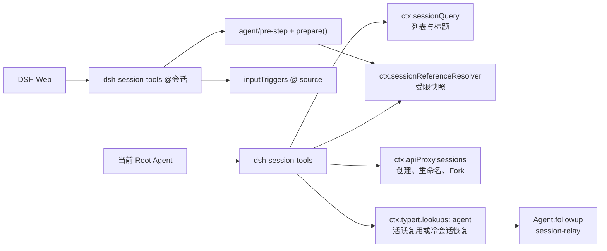

# DSH 会话能力套件设计

- 状态：`dsh-session-tools` 已完成 rc.6 工具与 `@会话` Live E2E；分屏仍等待 DSH Core API
- 首个验证目标：`@deepseek-ai/dsh@0.1.0-rc.6`
- 设计日期：2026-08-14
- 对应插件包：`dsh-session-tools`（工具、`@会话` 菜单与 pre-step 注入；分屏就绪后也落本包）

## 1. 目标

DSH 的 Session Log 是会话的持久事实，但 rc.6 的模型侧缺少通用会话管理能力，Web 端也只能渲染当前会话。本设计补齐以下闭环：

1. 人可以同时打开主会话和一个侧边会话；
2. Root Agent 可以列出并受控读取其他普通会话；
3. Root Agent 可以向其他普通会话投递下一轮消息；
4. Root Agent 可以新建真实会话；
5. Root Agent 可以重命名当前或其他普通会话；
6. Root Agent 可以从已完成轮次 Fork 会话。

本设计不改变 Session Log 格式，不新增 Surface Event 类型，不绕过 Agent 生命周期，也不把 Agent 生成的消息伪装成直接用户输入。

## 2. 交付边界

| 交付物 | 所在仓库 | 责任 | rc.6 状态 |
| --- | --- | --- | --- |
| `dsh-session-tools` 模型工具 | 本仓库 `packages/dsh-session-tools` | 六个模型工具、授权、快照读取、跨会话 relay | 已完成 Live E2E；`0.1.0` 已发布 |
| `dsh-session-tools` `@会话` | 同一包的 Web client + host `pre-step` | 输入框候选、`dsh-session:` mention、快照注入 | 已完成 Live E2E；日志保留 markdown URI；`0.1.0` 已发布 |
| 多会话 UI Core 扩展 | DSH 上游 | 多会话保活、任意会话渲染、根布局扩展槽 | 需要新增 |
| 分屏 UI | 同一包，待 Core API | 主辅双会话 UI、响应式抽屉、会话选择 | 等待 Core API，不单开包 |

需要修改 DSH Core 才成立的功能，在兼容版本发布前不得以正式纯插件包放入 `packages/`。

## 3. 总体架构

## 4. `dsh-session-tools`

### 4.1 工具清单

| 工具 | 作用 | 默认审批 |
| --- | --- | --- |
| `list_sessions` | 列出普通会话元数据，支持 id、标题、cwd 子串过滤 | 否 |
| `read_session` | 把一个其他会话的受限快照作为 sourced context 注入当前轮次 | 是 |
| `create_session` | 创建真实持久会话及 idle Agent | 是 |
| `rename_session` | 通过 Web 业务 API 追加用户标题事件 | 当前会话否，其他会话是 |
| `fork_session` | 从已完成轮次边界 Fork | 是 |
| `send_message_to_session` | 向其他普通会话排队一个独立 follow-up turn | 是 |

所有工具只允许当前进程中精确、正在运行且由 Agent Loop 驱动的 Root Agent 调用。Subagent 默认拒绝，且不能通过配置放宽。

### 4.2 会话列表

`list_sessions` 使用 `ctx.sessionQuery.listSessions()` 和 `readTitleSnapshots()`，不依赖 SQLite 全文检索。它：

- 排除 `header.origin === "subagent"` 的会话；
- 保留 SessionQuery 的确定性顺序；
- 返回 `sessionId`、title、cwd、createdAt、parentSessionId、agentPreset、live、persisted、current；
- 查询仅匹配 id、标题和 cwd，不搜索正文；
- `limit` 有 1–100 的固定范围并约束返回结果；底层标题批量读取仍覆盖 SessionQuery 返回的普通会话集合，不把返回上限误写成查询语料上限。

### 4.3 读取快照

`read_session` 不返回原始事件日志。它复用 `ctx.sessionReferenceResolver.prepare()`：

- 拒绝引用当前会话；
- 只投影直接用户文本、Assistant 文本和标准 compaction checkpoint；
- 排除工具调用、推理、内部上下文、未完成 chunk 和被 shadow 的事件；
- 使用 session-reference 的单来源 65 KiB 预算；
- 通过 `ToolRunContext.deferContext()` 注入 `source.kind = "session-reference"` 的 untrusted context；
- 工具结果只返回捕获 seq、保留/省略数量和截断状态，不复制整段正文。

### 4.4 创建、重命名和 Fork

三个写操作只调用 `ctx.apiProxy.sessions`：

- `create_session` 默认继承调用会话的 cwd 与 agentPreset，也允许在审批后显式指定；
- `rename_session` 使用与 Web 相同的标题规范化、pin 和日志语义；
- `fork_session` 使用 `atSeq` 选择第一个不早于锚点的 `turn/end`，省略时使用最后一个已完成轮次，并继承 cwd、model、workspace 与 lineage。

禁止直接调用 `SessionStore.create()`、`SessionStore.fork()` 或直接追加标题事件。

### 4.5 跨会话发送

`send_message_to_session` 的执行顺序：

1. 校验调用者为当前精确 Root Agent；
2. 拒绝向自身发送；
3. 完成一次 Approval；
4. 通过 `ctx.typert.lookups.get("agent").resolve(sessionId)` 解析目标；
5. 复用活跃目标，或由 Web 已配置的 Api Remote resolver 恢复普通冷会话；
6. 创建来源为 `session-relay`、`form: relay`、携带 `senderSessionId` 的 UserMessage；
7. 调用 `target.followup()`，让消息成为目标的独立下一轮。

目标是 subagent-owned session 时继续沿用 DSH 的 `agent-busy` fence；此工具不替代 `send_message` 子 Agent 通道。首版不支持跨会话 steer。

严禁以下实现：

- 直接 append 目标 Session Log；
- 调用 `session.prompt`，因为它会产生 `source.kind = user`；
- 省略 source，让非人类消息继承默认用户权威。

### 4.6 Approval 与失败语义

需要审批的工具调用 `ctx.approval.request()`，并携带原始 `callId`。只有 `allowed-once` 可以继续，其余结果全部失败关闭。Approval 的 asked/decided 审计对记录在发起会话的当前 open turn 中。

ApiProxy 的业务错误转换为带稳定 code 的 `HarnessError`；失败不得包装成成功结果。取消信号必须传递给 Approval、SessionQuery、session-reference 和支持取消的外部边界。

## 5. 侧边聊天与分屏

rc.6 的 `conversation.view` 只切换当前会话的 Chat/Trajectory 视图，`SessionRuntime` 也只 stage 全局 current session。完整分屏不能靠注册一个 view 完成。

### 5.1 DSH Core 前置 API

Core 需要提供三项通用扩展：

1. 引用计数的 `sessions.retain(sessionId)` / `SessionLease.release()`；
2. 可渲染任意 retained session 的公共 `SessionPane` 或等价容器；
3. 单实例根布局扩展槽 `layout.secondary-pane`。

current session 持有隐式 lease。辅助 lease 保活 history、mux、Agent scope 和输入状态，但不得改变 `list.current`。Core 只承载通用生命周期和渲染能力，不保存分屏产品状态。

### 5.2 Client 插件行为

`dsh-session-split-view` 在 Core API 可用后负责：

- 会话列表和标题区的“在侧边打开”；
- 侧边标题、会话选择器、关闭按钮；
- 桌面端 360–720 px 可调整宽度；
- 小屏幕使用复用同一 retained session 的 Drawer；
- 只持久化 `{ open, sessionId, width }`；
- 主辅会话独立 draft、scroll、view、details、composer、approval、question、queue、stop 和 steer；
- 同时接收两条流，事件严格按 session scope 路由；
- 从辅助面板新建或 Fork 后仍在辅助面板打开；
- 产品边界固定为一个主会话和一个辅助会话；
- 主窗口切换到辅助会话时自动关闭辅助面板，禁止同一 session 同时渲染两份。

只读 session peek drawer 可以作为实验，但不得作为完整分屏的验收替代。

## 6. `@会话` 引用增强

`@deepseek-ai/dsh-session-reference` 是快照准备服务，不会自动接管 Web composer。rc.6 没有公开 prompt 预处理钩子，本能力落在 `dsh-session-tools` 同一包，而不是新建 Client 包：

- Client 注册 `@` source（`name: "session"`），候选来自侧栏会话列表，排除当前会话和 `origin=subagent`；
- 选中后写入 `formatSessionReferenceMention()` 的 `@[标题](dsh-session:…)`；
- Host 在 `agent/pre-step` 只解析 `source.kind = user` 的直接消息，调用 `prepare()`，把快照插到本步消息前面；
- 每次最多三个来源、每来源 65 KiB，由 resolver 强制；
- 与 `read_session` 已注入的同一 sessionId 去重；
- 持久化用户消息仍保留 markdown URI，不改写为 TUI 的纯 `@标题`。

挂载 resolver 本身不等于启用 `@会话`；必须同时加载本包的 Web client 与 host `pre-step`。

## 7. 验证策略

### 7.1 自动化测试

- 权威校验：非 Agent、非当前精确 Agent、Subagent 均失败；
- Approval：所有非 `allowed-once` 结果失败且无副作用；
- 列表：过滤、排序、标题失败隔离、limit；
- 读取：快照通过 `deferContext` 注入，正文不复制到工具结果；
- ApiProxy：参数继承、RPC 错误、Fork 锚点；
- Relay：冷/热 lookup、source provenance、自发消息拒绝、一次投递；
- Cordis：六个工具注册、`agent/pre-step` 挂载和卸载；
- `@会话`：规范 URI 往返、只解析直接用户消息、与 `read_session` 去重、候选过滤/排序、选中写入 markdown mention。

### 7.2 真实 DSH 验证

`dsh-session-tools` 必须在声明的 DSH 版本上完成：

- profile 安装与启动；
- 六个工具真实可见；
- 至少两个普通会话间的创建、读取、重命名、Fork 和 relay；
- 活跃目标与冷目标各一次 relay；
- Approval UI 与 Session Log 审计回读；
- npm pack 内容和 `cordis.patch.yml` 安装回读；
- Web `@` 弹出普通会话候选、选中写入规范 mention，发送后注入 `session-reference`。

类型检查、构建、Node fixture 和本地链接验证不得描述为真实 DSH Web E2E。

分屏包还必须验证双流并行、独立审批/停止、资源释放、刷新恢复和移动端 Drawer。

### 7.3 rc.6 当前验证记录

截至 2026-08-14，`dsh-session-tools` 已完成：

- 17 个 Node 测试，覆盖 Root 权威、Approval 失败关闭、列表、sourced snapshot、ApiProxy 参数、relay provenance、Typert lookup 失败映射和 Cordis 导出契约；
- npm tarball 内容检查，产物不含 `src/`、`test/` 与开发依赖；
- 在独立临时 `DSH_HOME` 中安装到 `web` profile；
- `--dump-config` 回读 `session-reference-resolver` 与 `session-tools` Cordis 行；
- 复制默认 `web` profile，在独立端口真实启动 rc.6 Web；默认 profile 未修改；
- 真实模型成功调用 `list_sessions`、`create_session`、`rename_session`、`send_message_to_session`、`read_session` 和 `fork_session` 六个工具；
- 活跃目标 relay 返回 `RELAY_E2E_OK`；重启后先回读目标 `running: false`，冷恢复 relay 返回 `COLD_RELAY_E2E_OK`，两次消息均保留 `session-relay` 来源并各自完成独立轮次；
- `read_session` 注入的 `session-reference` 上下文包含目标 Assistant 回复，Fork 的 `parentSessionId`、cwd 与已完成轮次锚点回读正确；
- 在 Workspace Write 模式显示 Approval UI，选择 `允许一次` 后创建成功；发起会话 Session Log 同时记录对应的 `approval/asked` 与 `approval/decided: allowed-once`；
- 验证 rc.6 Full access 的 `approval.policy=never` 会自动拒绝 Approval request；受信 Full access profile 要调用默认需审批的工具，必须由部署者显式关闭对应插件审批字段，Root Agent 权威校验仍然生效；
- Live E2E 结束后停止独立端口的临时 Web 服务。

截至 2026-08-15，同一隔离 `web` profile 上还完成：

- 真实 Web 输入 `@列出`，菜单出现 `session` 组与「列出当前会话信息」；
- 选中后 composer 写入 `@[列出当前会话信息](dsh-session:…)`；
- 发送后页面出现「跨会话召回」，模型未再调用工具即可根据快照说明被引会话；
- 持久化用户消息仍保留 markdown URI，与 rc.6 缺少 prompt 预处理钩子的已知限制一致。

因此，`dsh-session-tools` 的六个工具与 `@会话` 已满足本节 7.2 的 rc.6 Live E2E。`dsh-session-tools@0.1.0` 已于 2026-08-15 完成 npm registry 发布、版本回读与隔离 profile 安装；分屏仍等待 Core API，不能据此描述为整个会话能力套件完成。

## 8. 兼容与发布

- `dsh-session-tools` 首个验证目标为 rc.6；只有实际验证过的版本才能写入兼容表；
- 分屏的最低版本是首个发布多会话 Core API 的 DSH 版本，当前不得猜测；落地时扩展 `dsh-session-tools`，不新建包；
- DSH 仍为 developer preview，所有 peerDependency、接口和 E2E 证据按精确版本记录；
- 没有可安装产物、profile 安装结果和版本兼容记录时不得创建 Release。

## 9. 已否决方案

1. 用 `conversation.view` 直接承载第二会话；
2. 在插件内复制完整 SessionRuntime；
3. 用 `SessionStore` 代替 Web 业务生命周期；
4. 直接 append 日志实现跨会话发送；
5. 用 `session.prompt` 冒充用户发送 relay；
6. 把 session-reference 描述成零代码 Web mention；
7. 在 Core API 发布前创建名义上的正式分屏包。
