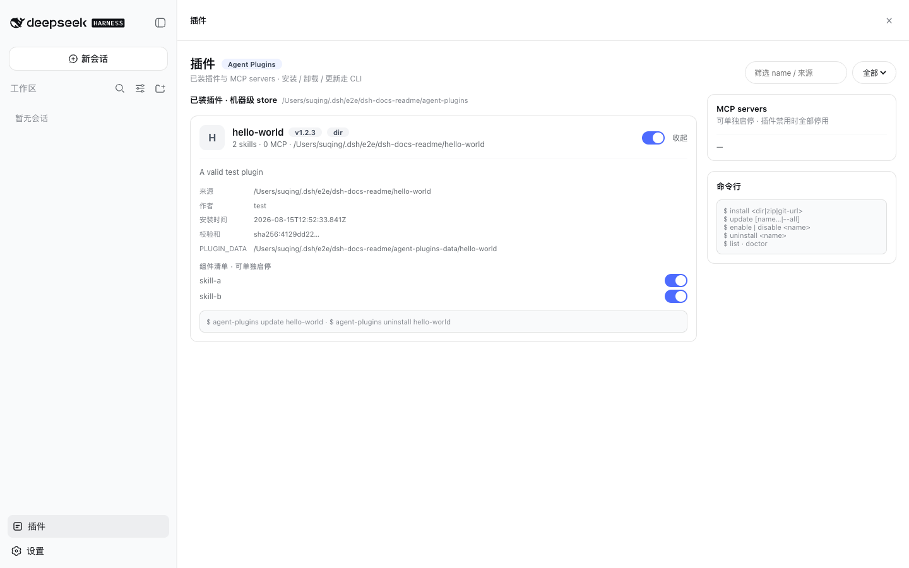

# dsh-agent-plugins

[English](README.md) | 中文

[DeepSeek Harness (DSH)](https://github.com/deepseek-ai/deepseek-harness) 的 [Agent Plugins 1.0.0](https://github.com/agentplugins/agent-plugins-spec) 适配插件。一个包覆盖 host bundle、Web 侧栏面板和 `agent-plugins` CLI。

已按 `@deepseek-ai/dsh@0.1.0-rc.6` 验证。

## 做什么

让 DSH 直接消费标准 Agent Plugin 包（`plugin.json` + `skills/` + `mcp.json`）：

- `skills/<name>/SKILL.md` 注册进 DSH 的 Skill registry（provider 名为 `agent-plugins`）。
- `mcp.json` 里的 server 映射进托管的 home patch，由 DSH 按 MCP 行拉起。
- CLI 负责在机器级 store 里安装、更新、启停和卸载。
- Web 侧栏的「插件」按钮打开覆盖会话列的面板：插件卡片、Skill/MCP 开关、筛选，以及 CLI 速查。



## Store

包放在 `$DSH_HOME/agent-plugins/`。台账是 `installed.json`，包含插件级 `enabled` 以及组件级 `skills.*.enabled` / `mcp.*.enabled`（两级默认都是 true）。CLI、host 适配和面板共用同一套库函数。

关掉整个插件后，它的 Skill 和 MCP 都不再出现。只关某一个 Skill 或某一个 MCP server 时，包里其余组件继续可用。

## CLI

```text
agent-plugins install <dir|zip|git-url>
agent-plugins uninstall <name>
agent-plugins update [name...|--all]
agent-plugins enable|disable <name>
agent-plugins enable|disable <name> --skill <n>
agent-plugins enable|disable <name> --mcp <server>
agent-plugins list [--json]
agent-plugins doctor
```

`install` 校验通过才写入 store。同 `name` 再次安装会替换文件并保留 `PLUGIN_DATA`。`uninstall` 删除文件和台账，同样保留 `PLUGIN_DATA`。`--mcp` 使用 `list` 里看到的限定名 `<plugin>__<server>`。

`doctor` 检查 store、台账和托管 patch 段。

## 面板

侧栏脚按钮打开覆盖会话列的 `shell.overlay`。面板列出机器级 store 和项目级（`.agent-plugins`）store，可按名称或来源（`dir` / `zip` / `git`）筛选，并能开关整个插件或单个 Skill / MCP server。展开卡片可看到来源、作者、安装时间、checksum、数据目录和组件开关。

项目 Skill 会从 `cwd/.agent-plugins` 以及项目根目录的 `.agent-plugins` 发现。

## 验证

兼容边界与验证证据记录在[设计文档](https://github.com/SisyphusSQ/dsh-plugins/blob/main/docs/design/dsh-agent-plugins.md)中。当前兼容基线为 `@deepseek-ai/dsh@0.1.0-rc.6`。

## License

MIT。
