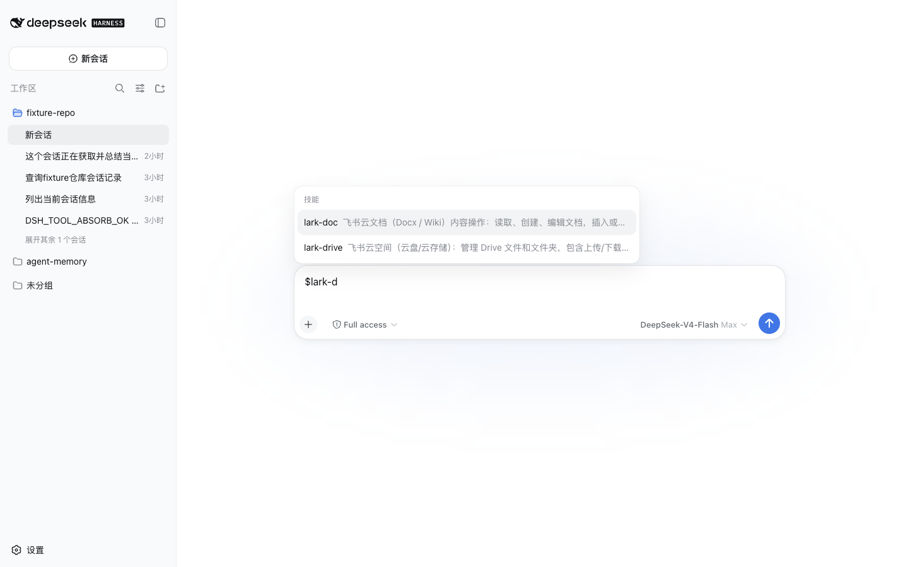

# dsh-composer-skill-mention

[English](README.md) | 中文

为 DeepSeek Harness Web 输入框提供 Codex 风格的 Skill 提及。

已按 `@deepseek-ai/dsh@0.1.0-rc.6` 验证。

## 做什么

在输入框里键入 `$` 或全角人民币符号 `￥`（U+FFE5），即可筛选当前会话可用的 Skills。选中候选后写入规范文本 `$skill-name `。进入 Agent step 之前，宿主通过 DSH 的 Skill registry 加载该 Skill 正文，并作为 `skill-invocation` 上下文注入。

`$dis` 与 `￥dis` 打开同一份候选。选中后草稿一律写成 `$skill-name `，而不是全角触发符。手工输入或粘贴 `$skill-name`、`￥skill-name` 具有相同的宿主语义。

## 行为

- 只解析直接用户消息中位于开头或空白后的 kebab-case Skill 名。
- 候选来自当前会话的 Skill catalog；注入正文复用 DSH 的 `renderSkillContent()`。
- 未知 Skill，以及禁止用户调用的 Skill，保持普通文本。
- `/name`、`$name`、`￥name` 同时出现时只注入一次 Skill 正文。
- `$HOME`、`foo$bar`、`$foo/bar`、`\$name` 和半角 `¥name` 不会产生 Skill 注入。
- 本插件不执行 Shell，也不会把本地 `SKILL.md` 绝对路径写进消息。

## 验证

兼容边界与验证证据记录在[设计文档](https://github.com/SisyphusSQ/dsh-plugins/blob/main/docs/design/dsh-composer-skill-mention.md)中。当前兼容基线为 `@deepseek-ai/dsh@0.1.0-rc.6`。

## License

MIT。rc.6 输入路由说明见 [THIRD_PARTY_NOTICES.md](THIRD_PARTY_NOTICES.md)。
