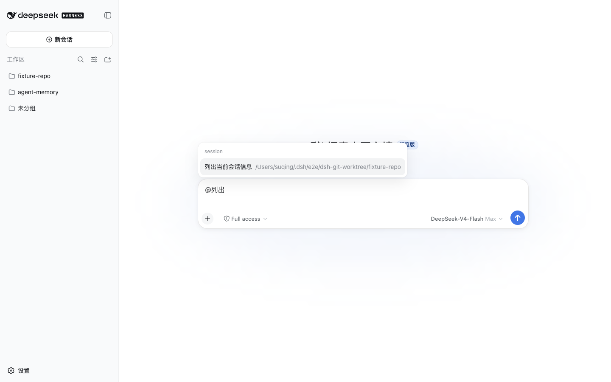

# @suqingsq/dsh-session-tools

[English](README.md) | 中文

DeepSeek Harness 的会话能力插件。同一包提供六个模型侧工具，以及 Web 输入框的 `@` 会话候选：选中后把另一会话作为带出处的上下文注入。

已按 `@deepseek-ai/dsh@0.1.0-rc.6` 验证。

## 安装

```bash
dsh plugin --profile web add @suqingsq/dsh-session-tools@0.2.0
```

卸载命令：`dsh plugin --profile web remove @suqingsq/dsh-session-tools`。

## 工具

这些工具只允许当前精确、正在运行且由 Agent Loop 驱动的 Root Agent 调用。Subagent 一律拒绝。跨会话消息使用 `source.kind = "session-relay"`，不会伪装成直接用户输入。

| 工具 | 行为 |
| --- | --- |
| `list_sessions` | 列出普通会话元数据（id、标题、cwd），不搜索正文。不含 subagent 会话。 |
| `read_session` | 将另一普通会话的受限、不可信快照附加到当前 step。工具调用、思考、内部上下文和未完成片段都会去掉。 |
| `create_session` | 通过 Host API 创建真实持久会话和 idle Agent。默认继承当前 cwd 与 agent preset。新会话不会自动被提问。 |
| `rename_session` | 使用与 Web 相同的业务 API 重命名当前会话或其他普通会话。 |
| `fork_session` | 在已完成轮次边界 Fork 普通会话，并继承 cwd、模型、Workspace、lineage 和标题种子。 |
| `send_message_to_session` | 给另一普通会话排队一个 follow-up turn，等待对方当前轮结束，只返回投递确认。 |

## `@` 会话提及

Web 输入框的 `@` 会多一组普通会话候选（排除当前会话和 subagent）。与当前 cwd 相同的会话排在前面。

选中后写入 `@[标题](dsh-session:…)`。Host 在 `agent/pre-step` 解析这些 mention，调用 `sessionReferenceResolver.prepare()`，把不可信快照插到本步消息前面。

人主动 `@` 不走 `read_session` 的 Approval。手打 `@标题` 不会注入；必须选出带 URI 的 markdown，或粘贴规范 `dsh-session:` URI。同一轮若 `read_session` 已经注入同一 `sessionId`，不再重复准备。



## 配置

以下字段属于 `session-tools` Cordis 行的 `config`：

| 字段 | 默认值 | 含义 |
| --- | --- | --- |
| `approveRead` | `true` | 读取其他会话快照前审批 |
| `approveCreate` | `true` | 创建会话前审批 |
| `approveRenameCurrent` | `false` | 重命名当前会话前审批 |
| `approveRenameOther` | `true` | 重命名其他会话前审批 |
| `approveFork` | `true` | Fork 前审批 |
| `approveSend` | `true` | 跨会话 relay 前审批 |

Approval 只有 `allowed-once` 会继续，其他回答全部失败关闭。

## 验证

兼容边界与验证证据记录在[设计文档](https://github.com/SisyphusSQ/dsh-plugins/blob/main/docs/design/dsh-session-capabilities.md)中。当前兼容基线为 `@deepseek-ai/dsh@0.1.0-rc.6`。

## License

[MIT](LICENSE)
