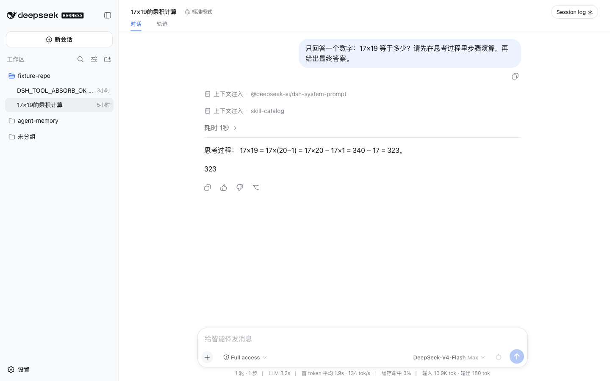
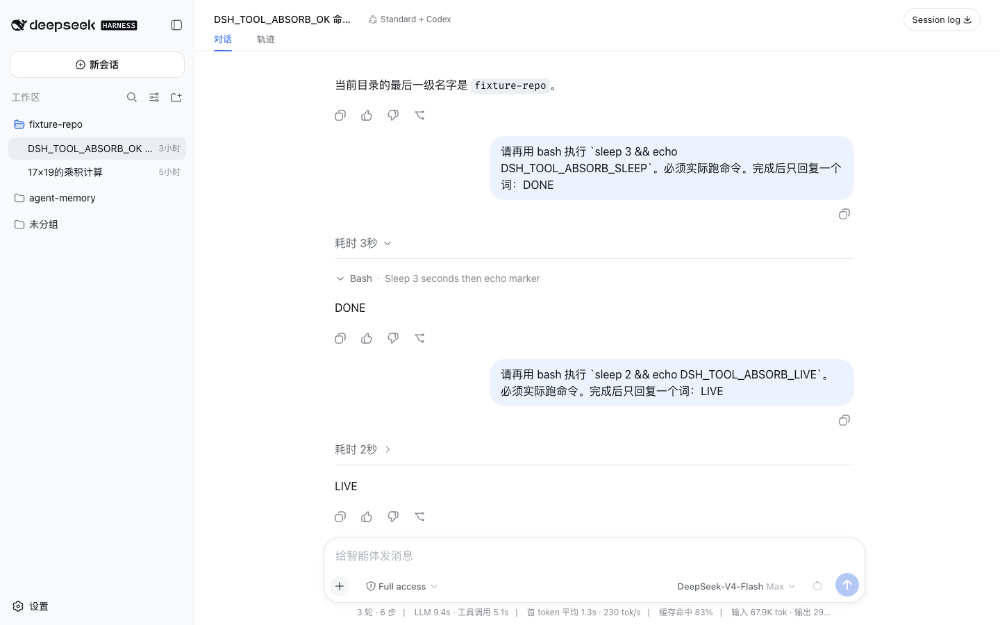

# dsh-thinking-collapse

[English](README.md) | 中文

为 DeepSeek Harness Web 聊天视图提供 Codex 式活动折叠。

已按 `@deepseek-ai/dsh@0.1.0-rc.6` 验证。

## 安装

需要 Node.js 22 或更高版本，并确保 `pnpm` 在 `PATH` 中：

```bash
dsh plugin --profile web add dsh-thinking-collapse@0.1.0
```

卸载命令：`dsh plugin --profile web remove dsh-thinking-collapse`。

## 做什么

插件替换聊天视图的 `assistant-step` 与 `tool-call` 渲染器，让每个模型 step 最多只有一条活动行。

step 仍在进行时——思考正在流式输出，或本步普通工具仍在执行，且还没有可见正文——活动行保持展开。它按 block 顺序展示思考 Markdown 和官方工具树，标题以紧凑时长持续更新，例如「已处理 2s」。

step 结束后——正文出现，或本步工具都已结束——活动行自动收成「耗时 2秒」这类标题。折叠态 header 不预览思考或命令。

点击即可展开：标题仍是耗时，分隔线下方是思考和官方工具卡片。再点一次收起。





## 行为

- 每个 step 一条活动行。一轮里可以有多条「耗时」（一步一条）。
- 活动时长从思考开始或本步第一个工具开始，到最后一次 tool/result 或正文出现。工具还在跑则继续计时。
- 吸收全部普通工具（bash / read / search / web / todo 等）。流式一开始就把工具画在活动体里，而不是先出现在聊天流再吸进去。
- `ask_user_question` 与审批提问仍留在编辑器或原聊天座位，不折进活动行。
- 没有思考、只有工具时仍出活动行。历史算不出时长时用「工具调用」/`Tool calls`，有思考但无时长时用「思考过程」/`Thoughts`。
- 折叠态去掉思考图标，使用右侧箭头和底部分隔线。
- 展开内容复用 DSH `MarkdownText` 与官方 `tool.call.toolview` 原子视图，并保留 Markdown、图片、未知 block、file mention 和 interrupted marker。
- 正文留在该 step 活动行外面。
- 不修改轨迹视图、模型请求或 Session log。

## 验证

兼容边界与验证证据记录在[设计文档](https://github.com/SisyphusSQ/dsh-plugins/blob/main/docs/design/dsh-thinking-collapse.md)中。当前兼容基线为 `@deepseek-ai/dsh@0.1.0-rc.6`。

## License

MIT。上游说明见 [THIRD_PARTY_NOTICES.md](THIRD_PARTY_NOTICES.md)。
