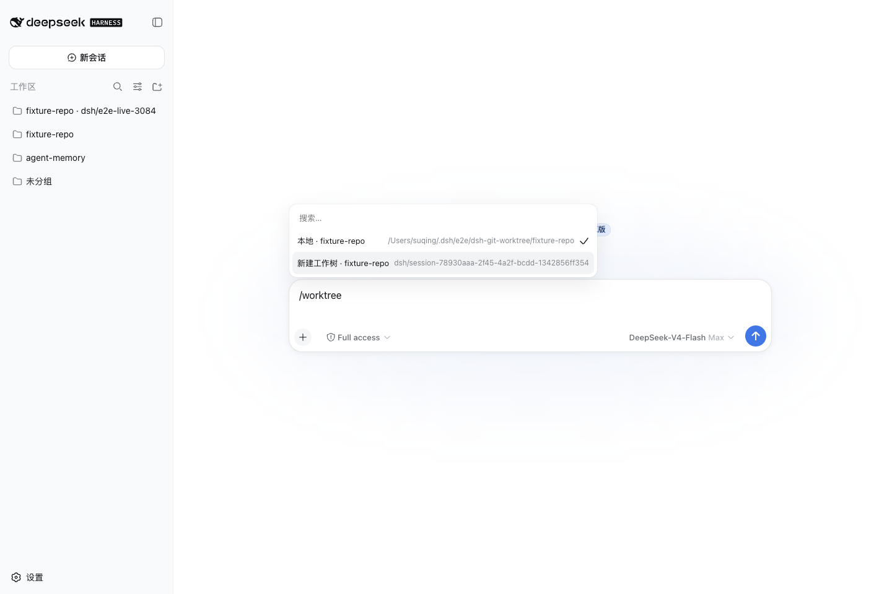

# dsh-worktree-workspaces

English | [中文](README.zh.md)

Create and archive Git linked worktrees for DeepSeek Harness. One package provides the `/worktree` slash command, the `worktree_create` model tool, the `dsh-worktree` CLI, and a Web picker that switches DSH Workspace.

Verified with `@deepseek-ai/dsh@0.1.0-rc.6`.

## Install

Requires Node.js 22 or later and `pnpm` on `PATH`:

```bash
dsh plugin --profile web add dsh-worktree-workspaces@0.1.0
```

Remove it with `dsh plugin --profile web remove dsh-worktree-workspaces`.

## What it does

Git's own `git worktree list --porcelain -z` is the source of truth for worktrees. DSH Workspace is only the Web/session entry. The plugin does not keep a second inventory.



## `/worktree`

These commands run directly. They are not sent to the model.

| Input | Result |
| --- | --- |
| `/worktree status` | Prints the repository root, current path, branch, and worktree count. |
| `/worktree new [branch]` | Creates a new branch and linked worktree, then registers it as a DSH Workspace. Omitting the branch uses `dsh/<session-id>`. |
| `/worktree` | On Web, opens a `popupSelect` menu: **本地** (original checkout), **工作树** (the current managed worktree, when you are already on one), and **新建工作树**. Choosing **新建工作树** creates the worktree and switches to a new Workspace session. Headless prints status instead. |

Uncommitted changes in the source checkout are not copied. The plugin does not create DSH sessions by itself; after a successful Web pick, DSH client-runtime creates or reuses a blank session for the target Workspace.

## `worktree_create`

The model uses this tool when it needs to orchestrate a Git worktree. It returns an absolute `cwd` for a new session. `repository` defaults to the current session cwd. Modes:

- `new-branch` — create a local branch (optional `startPoint`, default `HEAD`)
- `existing-branch` — check out an existing local branch
- `detached` — detached HEAD at `startPoint` or `HEAD`

## CLI

```bash
dsh-worktree create --repo /path/to/repository --branch suqing/my-task --at HEAD
dsh-worktree create --repo /path/to/repository --existing my-branch
dsh-worktree create --repo /path/to/repository --detach --at HEAD
```

Default layout:

```text
~/.dsh/worktrees/<worktree-id>/<repo-name>/
```

The command prints JSON. `next.cwd` is the directory a new DSH session should use. `sourceDirty: true` means the source repository has uncommitted changes; those changes are not copied.

Preview worktrees whose root directory mtime is older than seven days, then archive them:

```bash
dsh-worktree archive --days 7
dsh-worktree archive --days 7 --apply
```

Archive uses `git worktree move`. Locked worktrees, non-linked worktrees, paths outside the managed root, and directories that do not match the two-level layout are skipped. Apply writes:

```text
~/.dsh/archived_worktrees/<timestamp>/manifest.jsonl
```

mtime is an age heuristic, not last DSH session activity. The CLI does not schedule itself. Archived worktrees stay Git-linked; you can keep working at the archive path or `git worktree move` them back.

The CLI is a separate process. `--base-dir` and `--archive-dir` override the defaults (`~/.dsh/worktrees` and `~/.dsh/archived_worktrees`). It does not read Cordis profile config.

## Bundle config

```yaml
- id: worktree-workspaces
  name: 'dsh-worktree-workspaces'
  config:
    baseDir: '~/.dsh/worktrees'
```

## Verification

The compatibility boundary and verification evidence are recorded in the [design document](https://github.com/SisyphusSQ/dsh-plugins/blob/main/docs/design/dsh-worktree-workspaces.md). The current compatibility baseline is `@deepseek-ai/dsh@0.1.0-rc.6`.

## License

[MIT](LICENSE)
